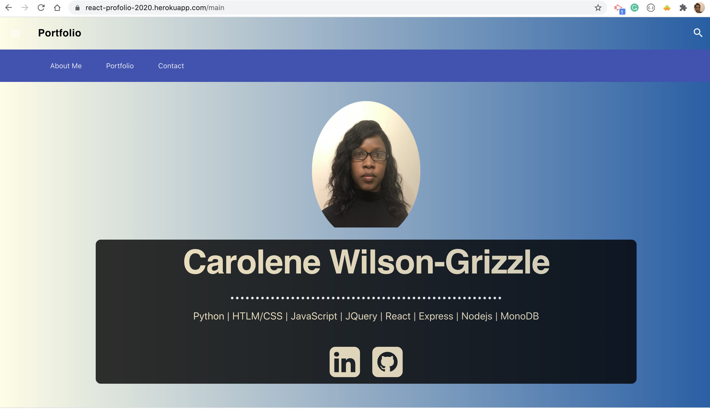
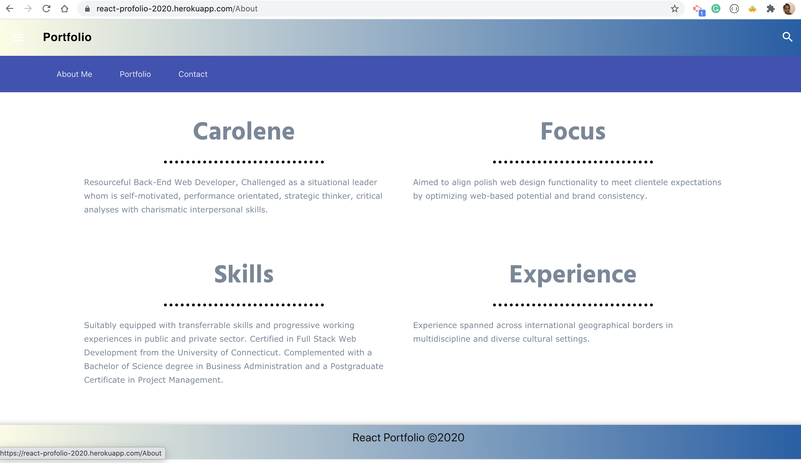
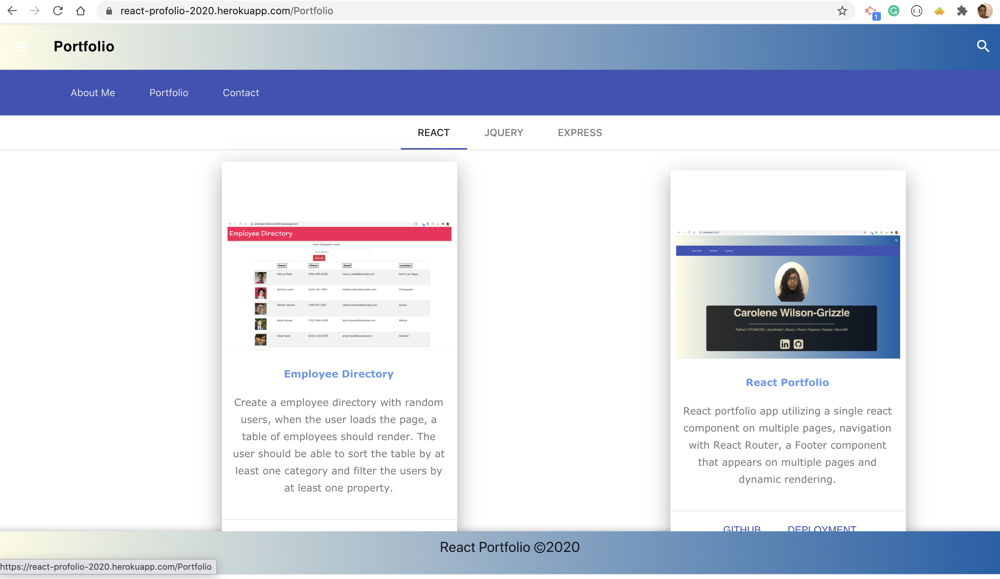
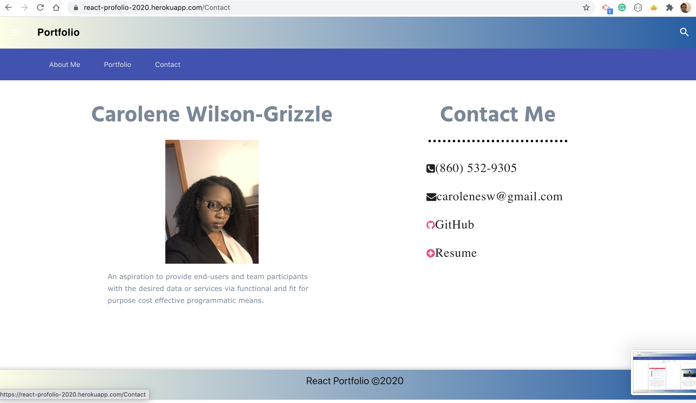

#  Project Title: React Portfolio

## Badges: 

 

## Technology

- Reactjs

## Description: 

* Create a user profolio with Reactjs. The application's UI should be broken up into the following.

- There should be at least a Header component that appears on multiple pages
- A single Project component that will be used multiple times on a single page
- Navigation with React Router, dynamic rendering, or another third part router
- A Footer component that appears on multiple pages

## Table of Content: 

* [Installation](#installation)  
* [Usage](#usage)
* [License](#license)
* [Contributors](#contributors)
* [Tests](#tests)
* [Questions](#questions)
* [Link](#links)
* [Images](#images)

## Installaion:
* npm install
* npm start

## License: 
* MIT
# Contributing: 
* Pull request and stars are always welcome.
## Testing: 
* N/A

## Questions
If you have any questions, please contact at:   
Email: carolenesw@gmail.com

## link

* Repo link:
https://github.com/Carolenesw/Employee_Directory

* Deployed URL: 
https://employee-directory2020.herokuapp.com/

## Images

* Home Page

* About Me Page

* Portfolio Page

* Contact Page

